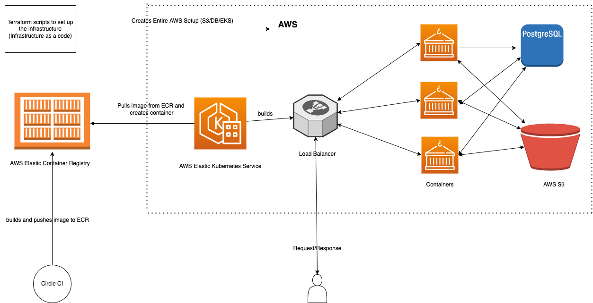

# Referral App :moneybag:

A Fullstack App built using API only Rails and React.

## How it works

### Logged in User :unlock:

- User should be able to Login/Signup.
- User should be able to invite other users to the platform.
- User should be able to accept an invite.
- User should be able to see the list of invited users with invitation status.
- User should be able to logout.

### Demo Video


https://user-images.githubusercontent.com/15953305/213204019-53ac44f5-36b7-4bd6-8c3b-8e11b16b4b5a.mp4


## Prerequisites

This app uses :- 

- Ruby on Rails 7.0
- Ruby 3.0.1
- Devise as an authentication module
- Postgres 13
- Rspec for unit tests
- React for frontend
- Material UI for forms and fields
- Letter Opener for emails on development environment

## Installation

### Rails App

- `git clone git@github.com:murtaza-bagwala/referral-app.git`

- `cd rails-api-app`

- `rvm use 3.0.1`

- `bundle i`

- `rename .env.example to .env and add the DATABASE_URL and REACT_HOST`

- `rails db:setup`. This will create the DB and run the migration.

- `rails s`

- `rspec spec/. for testcases`

### React App

- `git clone git@github.com:murtaza-bagwala/referral-app.git`

- `cd react-app`

- `npm i`

- `rename .env.example to .env and add the REACT_APP_API_HOST which points to Rails API host`

- `npm start`

or if you are familier with docker then just run these commands

- `docker compose build`
- `docker compose up`
- `docker compose run app rake db:setup`

***note: docker-compose uses Dockerfile.local defined in separate root folders of both API and React App***

## Devise User Model

It contains a model called as `User` which has properties like `name`, `email`, `phone_no` and `address` etc. I am using `devise-invitable` module for sending an invite to users.

## React Architecture

I am using `useState` for each component and storing the `jwt` in session storage and on logout clearing the token. Also used `react-router` to render the pages based on the path as for example on `/invite/accept` we show confirm invite page and default we show `signin` page for user to login etc.

## APIs

**To register the User**

`POST:- http://localhost:3001/api/users/signup`

Request Body:- 

```
{
  "user": {
      "addess": "NY city 7816",
      "email": "bagwalasrock@gmail.com",
      "phone_no": "702039404",
      "password": "testpassword",
      "password_confirmation": "testpassword",
      "name": "Test User"
  }
}


```

Response:- 

```
{
  "status": {
      "status": 201,
      "message": "Signed up sucessfully."
  },
  "data": {
      "id": 2,
      "email": "bagwalasrock@gmail.com",
      "phone_no": "702039404",
      "address": null,
      "name": "Murtaza Bagwala",
      "created_date": "18/01/2023",
      "invite_status": "unaccepted"
  }
}

```

**Login and Logout**

`POST:- http://localhost:3001/api/users/login`

Request Body:- 

```
{
  "user": {
      "email": "bagwalasrock@gmail.com",
      "password": "testpassword",
  }
}

```

Response :- 

```
{
    "status": {
        "status": 200,
        "message": "Logged in sucessfully."
    },
    "data": {
        "id": 2,
        "email": "bagwalasrock@gmail.com",
        "phone_no": "702039404",
        "address": null,
        "name": "Murtaza Bagwala",
        "created_date": "18/01/2023",
        "invite_status": "unaccepted"
    }
}
```

`DELETE:- http://localhost:3001/api/users/logout`

Request Header:- 

`Authorization: Bearer <token received in response headers of login/signup>`

Response:- 

```
{
    "status": {
        "status": 200,
        "message": "Logged out sucessfully."
    }
}
```

**Create Invite**

`POST:- http://localhost:3001/api/users/invitation`

Request Body:- 

```
{
  "user": {
      "email": "bagwalasrock15@gmail.com",
  }
}

```

Request Header:- 

`Authorization: Bearer <token received in response headers of login/signup>`

Response :- 

```
{
    "status": "invited"
}
```

**Accept Invite**

`PUT:- http://localhost:3001/api/users/invitation`

Request Body:- 

```
{
  "user": {
      "password": "testpassword",
      "password_confirmation": "testpassword"
  }
}

```

Response :- 

```
{
    "status": "Invite Accepted!"
}
```

**List all the current user invites**

`GET:- http://localhost:3001/api/users/invitations/invited_by_user`

Request Header:- 

`Authorization: Bearer <token received in response headers of login/signup>`

Response :- 

```
{
    "referralList": [
        {
            "id": 21,
            "email": "salaamnbhaighana@gmail.com",
            "phone_no": null,
            "address": null,
            "name": null,
            "created_date": "16/01/2023",
            "invite_status": "accepted"
        },
        {
            "id": 22,
            "email": "salaamnbhaighanabhai@gmail.com",
            "phone_no": null,
            "address": null,
            "name": null,
            "created_date": "16/01/2023",
            "invite_status": "unaccepted"
        },
        {
            "id": 23,
            "email": "bagwalamurtazanew@gmail.com",
            "phone_no": null,
            "address": null,
            "name": null,
            "created_date": "16/01/2023",
            "invite_status": "unaccepted"
        }
    ]
}
```

## Future Application Infrastructure

Now if scale out in future then this is how our deployment architecture would look like:- 



- Terraform scripts to set the up the infrastructure.
- Once the code is merged Circle CI would build and pushes the image the ECR
- Trigger the EKS to pull the images from ECR and create the .containers


